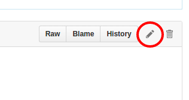
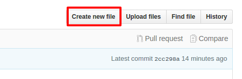
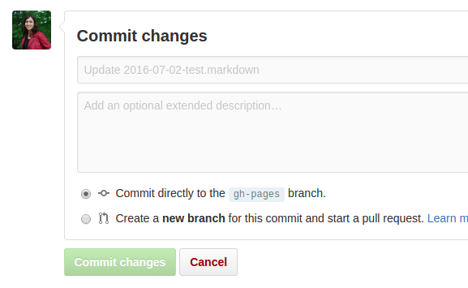

# Geotrek-website
Please gives us a visit at [http://geotrek.fr/](http://geotrek.fr/)


## Publication

Pour toute nouvelle publication, il est important de [respécter une certaine nomenclature](#nommage-des-fichiers).

Les articles se trouvent dans le dossier `_post`:  
https://github.com/makinacorpus/Geotrek-website/tree/gh-pages/_posts

### Ajout / Modification dans l'interface github

#### Modification
 


#### Ajout d'un nouvel article
 


#### Enregistrement (commit)
Pour sauvegarder les modifications, le nouvel article ou la suppression d'un article, il faut ensuite faire un **Commit**. Il suffit d'indiquer un titre et une description pour (ou laisser le texte par défaut) et cliquer sur "Commit changes".

 


### Nommage des fichiers

Le nom du fichier est très important. Il doit impérativement respecter la syntaxe suivante : `ANNEE-MOIS-JOUR-titre.markdown`. On peut aussi ajouter `-en` ou `-fr` à la fin du titre pour mieux identifier les fichiers en fonction de la langue mais cela n'aura pas d'impact sur le fonctionnement. La date indiquée dans le titre doit être la même que celle du Front Matter.


### Syntaxe / règles à respecter

Chaque article est précédé d'une entête appelé [Front matter](https://jekyllrb.com/docs/frontmatter/). Il est important de respecter certaines règles, comme l'exemple ci-dessous. Le Front Matter se distingue du contenu de l'article avec les `---` qui l'entoure.

```
---
title: The National Parc of Cévennes and its new touristic platform
date: 2016-02-01
lang: en
ref: post-20160201
---
```

- **title** : Le titre de l'article
- **date** : La date de l'article, qui sera affichée sur le site sous la forme "Août 2016". Il est important de respecter le format `aaaa-mm-jj`. Les articles seront ensuite affichés du plus récent en plus ancien.
- **lang** : La langue de l'article
- **ref** : La référence de l'article : sert à identifier les versions traduites des articles. On peut mettre ce qu'on veut, pourvu qu'il soit unique à chaque nouvel article et que sa version en/fr soit identique.

Tout ces paramètres sont obligatoires.


## Développement

### Lancer en local

Nécéssite un environnement Ruby (cf [la doc de Jekyll](https://jekyllrb.com/docs/installation/))

```
bundle install
bundle exec jekyll serve
```

### Publier sur gh-pages

```
git push origin gh-pages
```
